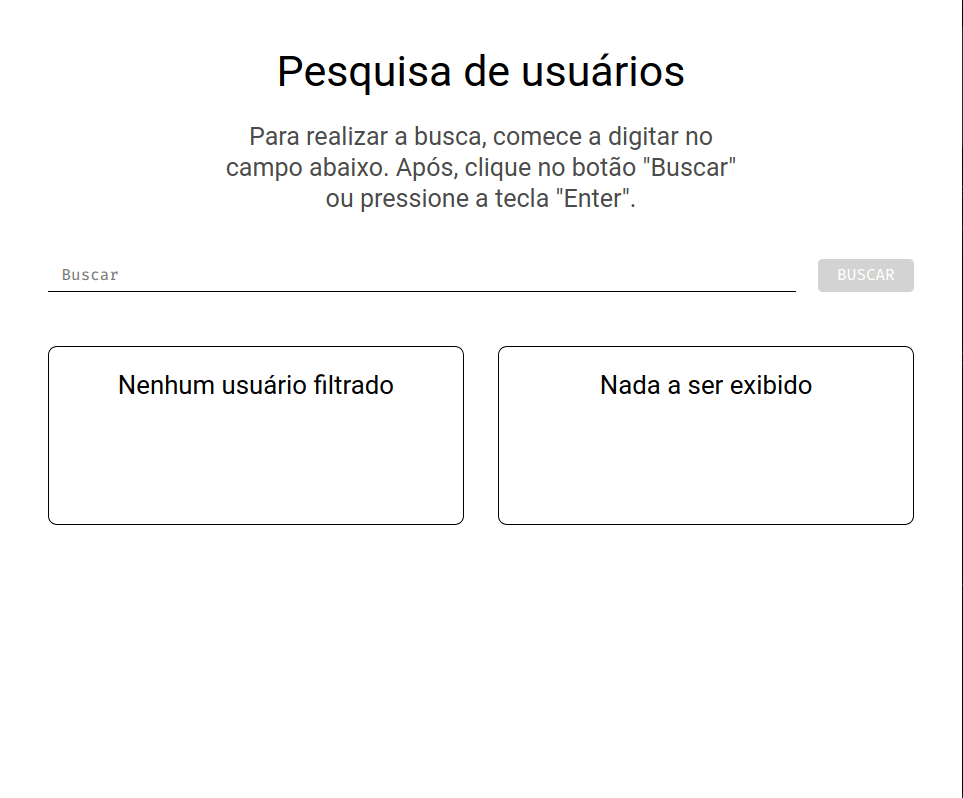

# Pesquisa em dados de API

Projeto desenvolvido como desafio do primeiro módulo do bootcamp Fullstack do IGTI. Funcionalidade de pesquisa em dados obtidos de API pública, usando apenas Javascript puro (*no frameworks*).



## Getting Started

### Pré-requisitos

Nenhum. Basta clonar o repositório em sua máquina e acessar o arquivo *index.html*.

```
git clone https://github.com/tadomaitis/igtiChallenge1.git
```

## Tecnologias utilizadas

* [HTML5](https://dev.w3.org/html5/spec-LC/)
* [CSS](https://developer.mozilla.org/en-US/docs/Web/CSS)
* [Javascript](http://vanilla-js.com/)

## Autor

* **Thiago Adomaitis**


## License

Este projeto é licenciado sob a licença MIT - veja o arquivo [LICENSE.md](LICENSE.md) para mais detalhes.

## Acknowledgments

* Hat tip to anyone whose code was used
* Inspiration
* etc

README template by [PurpleBooth](https://github.com/PurpleBooth).